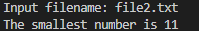
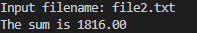

# hw1a

## Description
This C program is designed to find the smallest number in a file. It prompts the user to input a filename, reads the numbers from the specified file, and then identifies and outputs the smallest number found in the file.

## Usage
1. Compile the program using a C compiler (e.g., gcc).
2. Execute the compiled program.
3. Input the filename containing the numbers you want to analyze.

## Input
The program expects the user to input the filename containing the numbers to be analyzed. The file should contain integers separated by whitespace.

## Output
The program will output the smallest number found in the specified file.

# hw1b

## Description
This C program calculates the sum of all floating-point numbers found in a text file. It prompts the user to input a filename, reads the file, extracts the numbers (both integers and floating-point), calculates their sum, and finally outputs the result.

## Usage
1. Compile the program using a C compiler (e.g., gcc).
2. Execute the compiled program.
3. Input the filename containing the text with numbers you want to calculate the sum of.

## Input
The program expects the user to input the filename containing the text with numbers to be analyzed. The file should contain numbers separated by whitespace.

## Output
Upon successful execution, the program will output the sum of all floating-point numbers found in the specified file.

